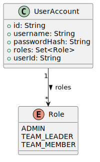
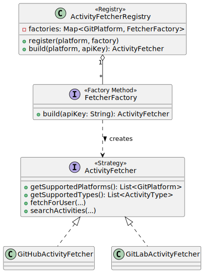
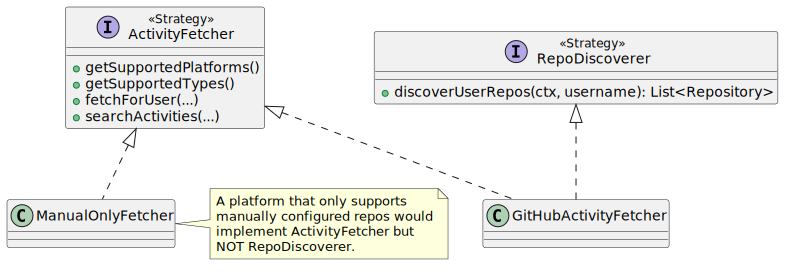
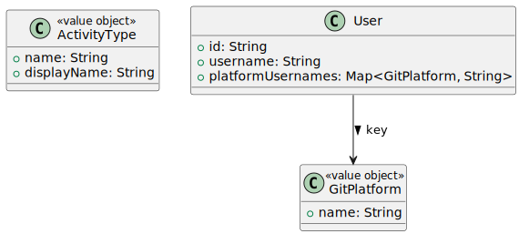
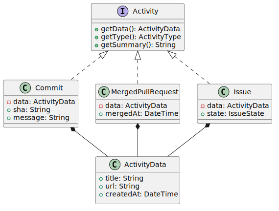

# Architecture Decision Records

This document captures the key architectural decisions made for the Contribution Tracker application, together with the context, rationale, and consequences of each decision.

**Technology stack:** Go (Chi router, pgx/v5), PostgreSQL 16, nginx, Podman containers.

---

## ADR-1: Architecture Style — Hexagonal (Ports & Adapters)

### Context

The application integrates with multiple external git servers (GitHub, GitLab) and persists operational data to PostgreSQL. It must be easy to add new git server platforms, new contribution types, and new persistence backends without modifying existing business logic.

### Decision

Adopt the **Hexagonal Architecture** (Ports & Adapters) with four layers:

| Layer | Responsibility |
|-------|----------------|
| **Domain** | Entities, value objects, enums — no dependencies on other layers |
| **Application** | Use cases, service ports, persistence ports, fetcher ports |
| **Infrastructure** | Adapters: pgx repositories, GitHub/GitLab API clients and fetchers |
| **Presentation** | HTTP handlers (controllers), middleware, DTOs |

Dependencies always point inward: Presentation → Application ← Infrastructure → Domain.

> See [`design.puml`](design.puml) for the full layer-connector diagram.

### Rationale

- **Testability**: Application logic can be tested against port interfaces, with no need for real databases or HTTP servers.
- **Extensibility**: New adapters (e.g. a Bitbucket fetcher) plug into existing ports without touching business logic.
- **Separation of concerns**: Domain rules are isolated from transport, serialization, and API details.

A traditional layered architecture was considered but rejected because it allows upper layers to reach through to lower ones, coupling transport to persistence.

### Consequences

- Every external dependency requires a port interface in the Application layer and an adapter in Infrastructure.
- Slightly more files and indirection than a flat structure, but the modularity pays for itself as the number of integrations grows.

---

## ADR-2: MVC with Containerized Separation

### Context

The application needs a web UI for report visualization with dynamic filtering, a backend API for data processing, and a database for operational state. The requirements call for modularity and future horizontal scaling.

### Decision

Apply the **MVC pattern** across three Podman containers:

| Container | MVC Role | Technology |
|-----------|----------|------------|
| **frontend** | View | nginx serving static HTML/CSS/JS SPA |
| **api** | Controller + Model | Go HTTP handlers (Controller), application services (Model) |
| **db** | Persistence | PostgreSQL 16 |

nginx reverse-proxies `/api` requests to the API container.

> See [`deployment.puml`](deployment.puml) for the container topology.

### Rationale

- **Horizontal scaling**: The API container is stateless; scaling it means running more replicas behind a load balancer.
- **Independent deployment**: Frontend and API can be rebuilt and deployed independently.
- **Podman**: Rootless containers with podman-compose provide Docker-compatible orchestration without a daemon.

### Consequences

- Frontend changes require rebuilding the frontend container.
- The API container must remain stateless — all state lives in PostgreSQL or is passed via JWT.

---

## ADR-3: Role Model — Additive Multi-Role RBAC with Per-Team Leadership

### Context

Three distinct roles exist: administrator, team leader, and team member. A single user may hold multiple roles simultaneously (e.g. an admin who is also a team leader). Roles determine which UI elements are visible and which API actions are permitted.

Team leadership is **per-team**: a team can have multiple leaders, and a user can lead multiple teams. The `TEAM_LEADER` role is a **derived role** — a user holds it if and only if they lead at least one team. Leadership is stored in a `team_leaders` junction table; each team must have at least one leader.

### Decision

Implement an **additive multi-role model** where `UserAccount` holds a `Set<Role>`, combined with a **per-team leadership model** via the `team_leaders` junction table:

**Permission matrix:**

| Action | TEAM_MEMBER | TEAM_LEADER | ADMIN |
|--------|:-----------:|:-----------:|:-----:|
| View own contributions | Yes | Yes | — |
| View full team report | — | Yes (own teams) | — |
| Manage team repositories | — | Yes (own teams) | — |
| Configure profile (platform usernames) | Yes | Yes | — |
| Manage users, teams, leaders | — | — | Yes |
| Backup / Restore | — | — | Yes |

### Rationale

- **Additive model**: Each role grants additional permissions. A user with `{TEAM_MEMBER, TEAM_LEADER}` gets the union of both.
- **Per-team leadership**: A `team_leaders` junction table maps leaders to teams. The `RequireTeamLeaderOrAdmin` middleware checks whether the caller is a leader of the *specific team* being accessed. This prevents a leader of Team A from managing Team B's repositories or viewing Team B's full report.
- **Derived TEAM_LEADER role**: The role is automatically granted when a user is made a team leader and removed when they no longer lead any team. This keeps the JWT-based role check fast while ensuring role consistency.
- **JWT carries roles**: The token includes the role set, so the middleware can enforce access without a database round-trip on every request. Per-team authorization still requires loading the team to check `LeaderIDs`.

### Consequences

- `RequireTeamLeaderOrAdmin` middleware checks team-specific leadership (admins bypass the check).
- `ReportService` scopes data by checking `team.LeaderIDs`: a leader sees all members only for teams they lead; a regular member sees only their own data.
- The UI shows a team selector when a leader belongs to multiple teams, allowing them to choose which team to view.
- Each team must retain at least one leader — removing the last leader is blocked.

---

## ADR-4: Strategy + Registry + Factory for Contribution Sources

### Context

Contributions are fetched from external git servers. The application initially supports two platforms (github.com and gitlab.cee.redhat.com), but must accommodate new platforms without modifying existing code.

### Decision

Combine three design patterns:

1. **Strategy** — `ActivityFetcher` is the interface; each platform provides its own implementation.
2. **Registry** — `ActivityFetcherRegistry` maps platforms to factories; adding a platform is a single `register()` call.
3. **Factory Method** — `FetcherFactory` creates a configured fetcher given an API key, allowing per-request instantiation.

### Rationale

- **Open/Closed Principle**: Adding Bitbucket requires one new `ActivityFetcher`, one `FetcherFactory`, and a `registry.register()` call. Zero existing code changes.
- **Template Method was considered** but rejected because platforms differ significantly in API structure (pagination, authentication, search). Strategy allows each implementation full control.
- **Factory per-request**: API tokens are stored per repository and loaded at report time. The factory pattern defers instantiation until the token is known, and repos are grouped by (platform, token) to reuse fetcher instances.

### Consequences

- Each platform's API details (URL structure, pagination, auth headers) are fully encapsulated in its fetcher and client.
- The registry is the single point of platform registration — startup wiring is centralized in `main.go`.

---

## ADR-5: Interface Segregation — RepoDiscoverer Split from ActivityFetcher

### Context

Some platforms support auto-discovering a user's repositories (e.g. GitHub's `/users/{username}/repos`), while others may not, or may only support manually configured repositories.

### Decision

Split repository discovery into a separate **`RepoDiscoverer`** interface:

### Rationale

- **Interface Segregation Principle (ISP)**: Clients that don't need discovery should not be forced to implement it. A fetcher for a platform with no discovery API would otherwise need a no-op method.
- **Runtime check**: `ReportService` checks if the fetcher also implements `RepoDiscoverer` before attempting discovery.

### Consequences

- Platform adapters that support both fetching and discovery implement both interfaces (e.g. `GitHubActivityFetcher`).
- Platform adapters that only support fetching implement `ActivityFetcher` alone.

---

## ADR-6: Open Value Objects for Extensibility (OCP)

### Context

The system must support new contribution types (e.g. code review comments, wiki edits) and new git platforms without modifying existing domain code. Users need platform-specific identities (e.g. a GitHub username, a GitLab username).

### Decision

1. **`ActivityType` and `GitPlatform` are open value objects** (structs with a `name` field), not enums. New instances are declared as constants; no switch statements need updating.

2. **`User.platformUsernames`** is a `Map<GitPlatform, String>` instead of platform-specific fields like `githubUsername`:

### Rationale

- **Open/Closed Principle**: Adding a new contribution type means defining an `ActivityType` instance and extending a fetcher. No existing class changes.
- **No per-platform fields**: If `User` had `githubUsername`, `gitlabUsername`, etc., every new platform would require a schema migration and domain change. The map approach scales to any number of platforms.

### Consequences

- No exhaustive switch/match on types — code that processes activities works generically through the `Activity` interface.
- Platform username lookup is `user.platformUsernames[platform]` with fallback to `user.username`.

---

## ADR-7: Service Port Interfaces (DIP)

### Context

Presentation handlers need to call application services. If handlers depend directly on concrete service classes, they cannot be tested in isolation and the dependency arrow points from outer to inner layer (violating hexagonal architecture purity).

### Decision

Define **port interfaces** for all application services:

| Port Interface | Concrete Implementation |
|----------------|------------------------|
| `AuthServicePort` | `AuthService` |
| `ReportServicePort` | `ReportService` |
| `BackupServicePort` | `BackupService` |

Handlers depend on port interfaces; concrete services implement them.

### Rationale

- **Dependency Inversion Principle**: High-level modules (handlers) depend on abstractions (ports), not on low-level modules (services).
- **Testability**: Handlers can be tested with mock implementations of service ports, without wiring the full application stack.
- **Consistency**: The same port pattern used for persistence repositories is now applied to services.

### Consequences

- Three additional interfaces in the Application layer.
- Wiring in `main.go` injects concrete services into handlers through the port interfaces.

---

## ADR-8: Composition over Inheritance for Activities

### Context

All contribution types (Commit, MergedPullRequest, Issue, PullRequestReview) share common data: title, URL, creation timestamp. Go does not support classical inheritance.

### Decision

Use **composition**: a shared `ActivityData` struct is embedded as a private field in each concrete activity type. All types implement the `Activity` interface.

### Rationale

- **Go-idiomatic**: Go has no class inheritance. Composition with interfaces is the standard approach.
- **Flexibility**: Each activity type can have its own fields (e.g. `sha` for commits, `mergedAt` for PRs) without a bloated base class.
- **Uniform handling**: Code that processes activities works through the `Activity` interface, regardless of the concrete type.

### Consequences

- Each new contribution type requires a struct with an `ActivityData` field and three interface methods.
- No deep inheritance hierarchies to maintain.

---

## ADR-9: Live Fetching — No Contribution Cache

### Context

Contribution data (commits, PRs, issues, reviews) could be cached in the database for faster subsequent access, or fetched live from git servers on every report request.

### Decision

**Fetch contributions live on every report request.** No contribution data is stored in the database.

### Rationale

- **Data freshness**: Cached contributions can become stale (e.g. a PR merged after the last cache refresh). Live fetching guarantees up-to-date results.
- **Storage simplicity**: The database stores only operational data (users, teams, repos, config). No schema for contributions, no cache invalidation logic.
- **Reduced complexity**: No background sync jobs, no stale-data detection, no cache warming strategies.

### Trade-offs

- **Latency**: Report generation takes longer because every request hits external APIs. Mitigated by SSE streaming (ADR-10), which shows results progressively.
- **API rate limits**: Heavy usage could hit git server rate limits. Mitigated by scoped queries (ADR-11) and per-team repository filtering.
- **Offline unavailability**: If a git server is unreachable, contributions from that server cannot be shown. This is acceptable because the data belongs to the external system.

### Consequences

- Backup/restore (ADR-12) is simpler: only operational data needs to be exported.
- The `Activity` domain types exist only in memory during report generation.

---

## ADR-10: SSE Streaming for Progressive Reports

### Context

Generating a team report requires fetching contributions for each member from external APIs. This can take seconds to minutes depending on team size and date range. The user should see results as they arrive, not wait for the entire report to complete.

### Decision

Use **Server-Sent Events (SSE)** to stream report results progressively:

1. Handler spawns `ReportService.generateReport()` in a goroutine.
2. The service sends one `UserReport` per team member through a Go channel.
3. The handler reads from the channel and writes each report as an SSE event.
4. The browser parses SSE events and updates the UI incrementally.

Event types: `USER_REPORT` (per-member data), `COMPLETE` (stream finished), `ERROR` (failure).

> See [`sequence_report.puml`](sequence_report.puml) for the full interaction flow.

### Rationale

- **SSE vs WebSockets**: SSE is simpler — unidirectional (server → client), built on standard HTTP, automatic reconnection. The client only needs to receive data, not send updates mid-stream. WebSockets would add unnecessary bidirectional complexity.
- **SSE vs Polling**: Polling requires the client to repeatedly query for new results, increasing latency and server load. SSE pushes data as it becomes available.
- **Goroutine + channel**: Go's concurrency primitives naturally model this pattern. The channel decouples report generation from HTTP response writing.

### Consequences

- The HTTP response is kept open for the duration of report generation.
- nginx must be configured with `X-Accel-Buffering: no` to avoid buffering SSE events.
- The browser uses `AbortController` to cancel stale requests when a new report is generated.

---

## ADR-11: Query Optimization and Concurrency

### Context

Each team report may involve dozens of repositories and multiple API calls per user. Unoptimized queries could overwhelm external git servers with massive or redundant requests.

### Decision

Apply three optimization strategies:

1. **Scoped queries**: Always include user, repository, and date range in API queries. Never fetch more data than needed.
   - Commits: `GET /repos/{repo}/commits?author={user}&since={since}&until={until}` — fully server-side filtered.
   - Issues/PRs: Use the Search API with `author:{user} created:{since}..{until}` — server-side filtering with client-side repo scoping.

2. **Enqueued requests**: When fetching contributions across many repositories, enqueue requests and process them with controlled concurrency (worker pool) to avoid locking or overwhelming the git server.

3. **Batch database loading**: Use multi-ID queries (`findByIds`) instead of N+1 individual lookups. Connection pooling via pgx/v5.

### Rationale

- Git servers enforce rate limits (e.g. GitHub: 5,000 requests/hour with authentication). Scoped queries minimize the number of requests and the data transferred.
- Controlled concurrency prevents thundering-herd scenarios where all requests fire simultaneously.
- Batch DB loading reduces round-trips to PostgreSQL.

### Consequences

- Each fetcher is responsible for building the most specific query its platform supports.
- The `ReportService` orchestrates fetching with concurrency control, not individual fetchers.

---

## ADR-12: Backup/Restore Scope

### Context

The administrator needs to back up and restore the application state. The database contains operational data (users, accounts, teams, repositories, configuration) but not contribution data (which is fetched live).

### Decision

Backup/restore covers **operational data only**:

| Included | Excluded |
|----------|----------|
| Users and platform username mappings | Contribution data (commits, PRs, issues) |
| User accounts (credentials, roles) | Report history |
| Teams (members, repository assignments) | Cached or derived data |
| Repositories (name, URL, platform, API token) | |

Backup is exported as a single JSON file. Restore overwrites all operational data.

### Rationale

- Contribution data is not stored (ADR-9), so there is nothing to back up.
- JSON format is human-readable and can be version-controlled or audited.
- Admin-only access ensures that backup files (which contain API tokens and password hashes) are not exposed to non-privileged users.

### Consequences

- Restoring a backup resets all users, teams, and configuration to the backup state.
- API tokens in the backup are stored in plaintext (acceptable since backup is admin-only and the file is not persisted on the server).

---

## ADR-13: Initial Git Server Sources

### Context

The application must support fetching contributions from external git servers. The initial deployment targets two specific platforms.

### Decision

Support two git server sources at launch:

| Platform | API Base URL | Scope |
|----------|-------------|-------|
| **GitHub** | `api.github.com` | Public GitHub |
| **Red Hat GitLab** | `gitlab.cee.redhat.com` | Internal corporate GitLab |

Both API clients accept a configurable base URL, enabling the same fetcher code to point at different instances (e.g. GitHub Enterprise, other GitLab instances).

### Rationale

- These are the two platforms where the team's contributions currently live.
- Configurable base URLs ensure that the same codebase works for self-hosted instances without code changes.
- The Strategy + Registry architecture (ADR-4) makes adding a third platform (e.g. Bitbucket) a localized change.

### Consequences

- Each repository is configured with its own API token (PAT) when added to a team by a team leader.
- Each user maps their platform-specific username via the profile endpoint.

---

## Diagram Index

| File | Description |
|------|-------------|
| [`design.puml`](design.puml) | Layer dependencies — ports connecting Presentation, Application, Infrastructure, Domain |
| [`design_domain.puml`](design_domain.puml) | Domain layer — entities, value objects, enums, Activity interface hierarchy |
| [`design_application.puml`](design_application.puml) | Application layer — service ports, persistence ports, fetcher ports, registry, RBAC |
| [`design_infrastructure.puml`](design_infrastructure.puml) | Infrastructure layer — pgx persistence adapters, GitHub/GitLab API clients and fetchers |
| [`design_presentation.puml`](design_presentation.puml) | Presentation layer — HTTP handlers (controllers), middleware, DTOs |
| [`deployment.puml`](deployment.puml) | Container deployment topology — frontend (nginx), api (Go), db (PostgreSQL), external APIs |
| [`use_cases.puml`](use_cases.puml) | Use case diagram — actors (Team Member, Team Leader, Administrator) and permitted actions |
| [`sequence_report.puml`](sequence_report.puml) | Sequence diagram — report generation flow with SSE streaming, RBAC scoping, repo discovery |
